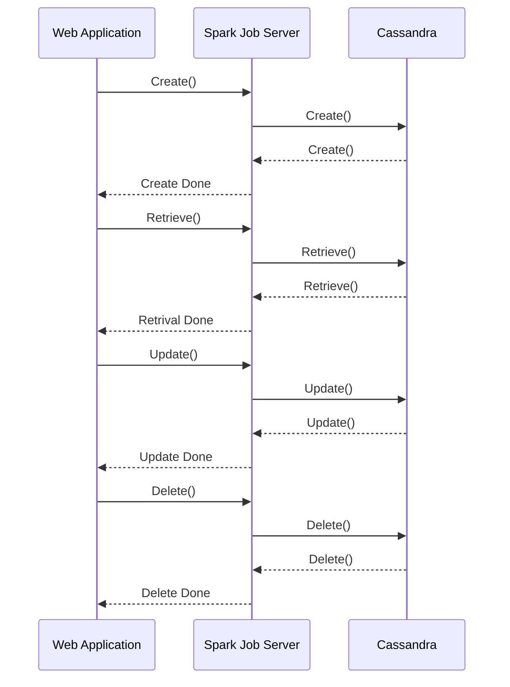

# LULZCLOUD
A Project by: 
- Abdullah, 
- Alvin, 
- Marcus, 
- Sze Yan, 
- You Chen


## Setting up Cassandra
### Setup and Create Environment
```bash
sdc-setup
```
```bash
eval "$(triton env --docker env)
```

### Pull Cassandra Image into Docker
```bash
docker pull cassandra:3.11.1
```

### Run Cass1
```bash
docker run -d --network zones --name cass1 cassandra:3.11.1
```

### Turn off Cass 1 Firewall
```bash
triton instance disable-firewall cass1
```

### Retrieve Cass 1 IP Address
```bash
 seed=$(docker inspect -f '{{ .NetworkSettings.IPAddress }}' cass1)
 ``` 
```bash
echo $seed
```

### Run Cass2
```bash
docker run -d --network zones --name cass2 cassandra:3.11.1
```

### Turn off Cass2 Firewall
```bash
triton instance disable-firewall cass2
```

### Retrieve Cass 1 IP Address
```bash
seed1=$(docker inspect -f '{{ .NetworkSettings.IPAddress }}' cass2) 
```
```bash
echo $seed1
```

### CQLSH
```bash
docker run -it --rm --network zones cassandra:3.11.1 cqlsh $seed
```

### Check Clusters
```sql
SELECT peer, data_center from system.peers;
```

### Create Keyspace
```sql 
Use cloudcomputing
```

### Create tables
```sql
CREATE TABLE meme(
id uuid, 
file text, 
title text, 
author text, 
category text, 
time date, 
likes int, 
PRIMARY KEY ((category,title,id))
) ;
```
### Exit CQLSH
```bash 
exit
```

## PHPCass (If without Spark Job Server and directly called from Cassandra)
### Pull PHPCass Image to Docker
```bash
docker pull oonlyo/phpcass
```

### Run PHPCass
```bash
docker run -d --name phpcass -e SSH_PASSWORD=password oonlyo/phpcass 
```

### Disabled PHPCass firewall
```bash
triton instance disable-firewall phpcass
```

### Enter PHPCass Shell
```bash
triton instance disable-firewall phpcass
```

## Setting up Spark Job Server (RESTFUL Web API)


## Web Application UML


